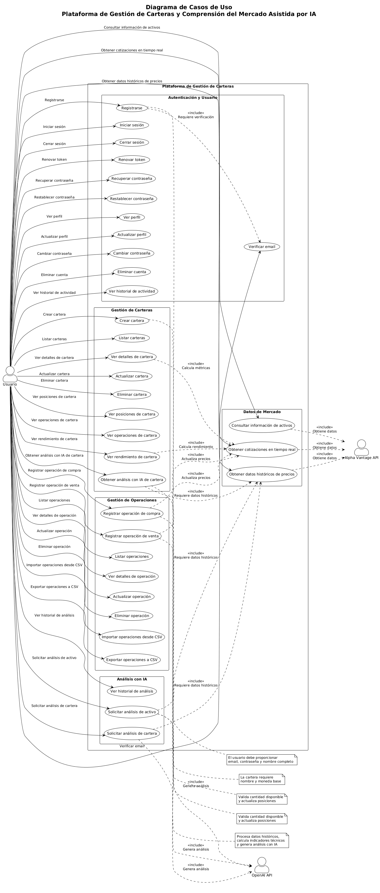
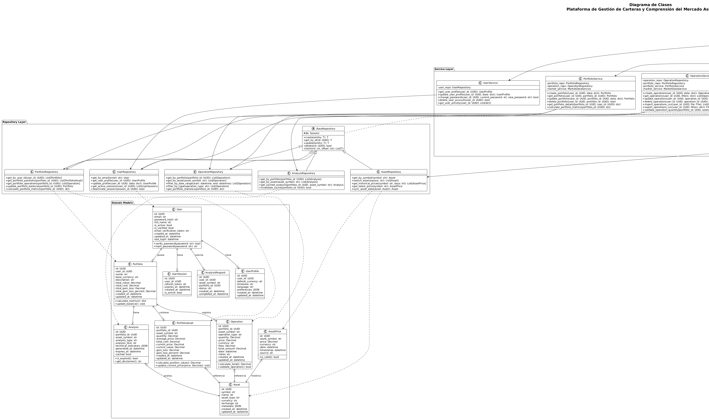
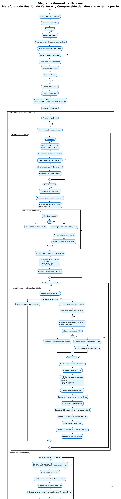
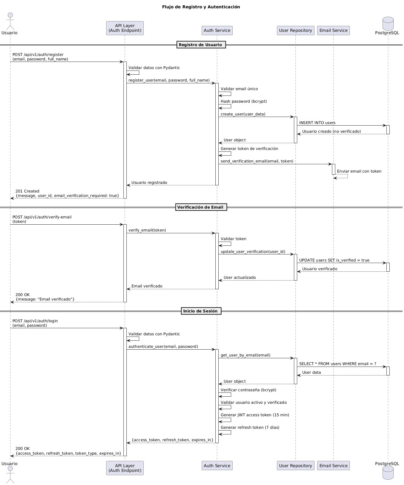

# Plataforma de Gestión de Carteras y Comprensión del Mercado Asistida por IA

## Introducción

Para este proyecto de la asignatura de Arquitectura de Software planteamos el desarrollo de una plataforma web orientada a la gestión de inversiones personales. La motivación principal surge de la necesidad de centralizar las tareas habituales de un inversor: registro de operaciones, consulta de balances, análisis de carteras y acceso a información actualizada del mercado financiero.

Consideramos que los inversores individuales carecen de herramientas accesibles que integren datos de mercado en tiempo real con capacidades de análisis inteligente. Por ello, proponemos una solución que combine información de mercado actualizada con herramientas de visualización y un módulo asistido por inteligencia artificial capaz de interpretar la evolución de precios y generar resúmenes comprensibles sobre las tendencias observadas.

El enfoque arquitectónico se centra en la construcción de un backend mediante una API REST desarrollada en Python, implementando patrones de diseño que garanticen la mantenibilidad y escalabilidad del sistema. La plataforma integra datos financieros en tiempo real con análisis asistido por IA para proporcionar información relevante al usuario.

## Integrantes

- Yago Ramos Sánchez
- Alan Ariel Salazar

## Objetivo General

Diseñar e implementar una plataforma web de gestión de carteras de inversión que integre datos de mercado en tiempo real con análisis asistido por inteligencia artificial, aplicando principios de arquitectura de software para garantizar la funcionalidad, seguridad y mantenibilidad del sistema.

## Objetivos Específicos

1. Desarrollar una API REST utilizando FastAPI que gestione la autenticación de usuarios, operaciones de compra y venta, y administración de carteras de inversión.
2. Implementar un sistema de integración con proveedores de datos financieros para obtener cotizaciones actualizadas de acciones, ETFs y criptomonedas.
3. Diseñar un módulo de análisis asistido por inteligencia artificial capaz de interpretar gráficos de precios y generar descripciones en lenguaje natural sobre tendencias de mercado.
4. Aplicar una arquitectura modular que permita la separación clara de responsabilidades entre las diferentes capas del sistema.
5. Implementar medidas de seguridad fundamentales incluyendo autenticación JWT y validación de datos.

## Metodología

Para el desarrollo de esta plataforma seguimos una metodología iterativa basada en la implementación progresiva de funcionalidades. Iniciamos con el diseño de la arquitectura general del sistema, definiendo las capas y componentes principales antes de comenzar la implementación.

El proceso de desarrollo se organizó en fases: primero establecimos la estructura base del backend y la configuración de la base de datos, luego implementamos la autenticación y los endpoints fundamentales para la gestión de usuarios y carteras. Posteriormente integramos las APIs externas para obtener datos de mercado y finalmente desarrollamos el módulo de análisis con inteligencia artificial.

Aplicamos patrones de diseño que facilitan la separación de responsabilidades, como el patrón Repository para abstraer el acceso a datos y el patrón Service para encapsular la lógica de negocio. Esta organización nos permite mantener un código mantenible y facilitar las pruebas unitarias de cada componente.

## Arquitectura del Sistema

Planteamos una arquitectura en capas donde cada capa tiene responsabilidades específicas y bien definidas. Creemos que esta separación facilita el mantenimiento, la testabilidad y la evolución del sistema.

### Capas de la Aplicación

La arquitectura se organiza en cuatro capas principales. La capa de presentación expone los endpoints HTTP que permiten la interacción con el sistema, gestiona las peticiones entrantes, valida los datos de entrada y retorna las respuestas apropiadas. La capa de servicios contiene la lógica de negocio de la aplicación, coordina las operaciones complejas, aplica las reglas de negocio y gestiona las transacciones. La capa de repositorios abstrae el acceso a datos y proporciona una interfaz para las operaciones CRUD sobre las entidades del sistema. Finalmente, la capa de modelos define las entidades del dominio y sus relaciones.

### Componentes Principales

El sistema está compuesto por tres componentes principales. El backend API es el servicio principal desarrollado en FastAPI que gestiona todas las operaciones de la plataforma. El módulo de IA es un componente independiente que procesa datos de mercado históricos y genera análisis descriptivos usando la API de OpenAI. Para el almacenamiento de datos utilizamos PostgreSQL como sistema de gestión de base de datos relacional.

## Diagramas del Sistema

Para documentar y visualizar la arquitectura y los flujos de la plataforma, desarrollamos varios diagramas que representan diferentes aspectos del sistema desde distintas perspectivas.

### Diagrama de Casos de Uso

Este diagrama ilustra las interacciones principales entre los usuarios y la plataforma, permitiendo visualizar las funcionalidades clave del sistema desde la perspectiva del usuario. Organizamos los casos de uso en varios paquetes: autenticación y gestión de usuario, gestión de carteras, gestión de operaciones, datos de mercado y análisis con inteligencia artificial. El diagrama muestra cómo los usuarios interactúan con cada funcionalidad y cómo estas se relacionan con los sistemas externos como Alpha Vantage API y OpenAI API.



### Diagrama de Clases

El diagrama de clases representa la estructura estática del sistema organizada en tres capas principales: modelos de dominio, capa de repositorios y capa de servicios. Planteamos este diagrama para visualizar las relaciones entre las entidades del sistema, los patrones de diseño aplicados y la separación de responsabilidades entre las diferentes capas. Muestra cómo los servicios utilizan los repositorios para acceder a los modelos de dominio, y cómo estos se relacionan entre sí mediante asociaciones bien definidas.



### Diagrama General del Proceso

Este diagrama representa el flujo completo del sistema desde la perspectiva del usuario, comenzando con el acceso al sistema y la autenticación. Documenta los principales procesos que el usuario puede realizar: gestión de carteras, gestión de operaciones y análisis con inteligencia artificial. Planteamos este diagrama para visualizar cómo se integran los diferentes módulos del sistema, desde la obtención de precios hasta la generación de análisis mediante inteligencia artificial, incluyendo los mecanismos de caché y las integraciones con servicios externos.



### Diagrama de Secuencia

El diagrama de secuencia documenta los flujos de interacción temporal entre los diferentes componentes del sistema. Incluimos diagramas para los procesos más relevantes: registro y autenticación de usuarios, creación de carteras, registro de operaciones de compra y venta, consulta de detalles de cartera y generación de análisis con inteligencia artificial. Estos diagramas nos permiten visualizar el orden de las llamadas entre componentes, cómo se propagan los datos a través de las capas y cómo se gestionan las interacciones con servicios externos y la base de datos.



## Estructura del Proyecto

```
portfolio_and_market_insight_platform/
├── backend/                          # Backend principal de la aplicación
│   ├── app/                          # Aplicación principal
│   │   ├── api/                      # Capa de presentación - Endpoints HTTP
│   │   │   └── v1/                   # Versión 1 de la API
│   │   │       ├── auth/            # Endpoints de autenticación
│   │   │       ├── portfolios/      # Endpoints de carteras
│   │   │       ├── operations/      # Endpoints de operaciones
│   │   │       ├── users/           # Endpoints de usuarios
│   │   │       └── market/          # Endpoints de datos de mercado
│   │   ├── core/                     # Configuración y componentes centrales
│   │   │   ├── config/              # Configuración de la aplicación
│   │   │   ├── database/            # Configuración de base de datos
│   │   │   └── security/            # Componentes de seguridad
│   │   ├── models/                   # Modelos de dominio (SQLAlchemy)
│   │   ├── repositories/             # Capa de repositorios (patrón Repository)
│   │   ├── schemas/                  # Esquemas de validación (Pydantic)
│   │   ├── services/                 # Capa de servicios (lógica de negocio)
│   │   ├── middleware/               # Middleware personalizado
│   │   └── utils/                    # Utilidades y funciones auxiliares
│   ├── main.py                       # Punto de entrada de la aplicación
│   └── requirements.txt              # Dependencias del backend
├── ai_module/                        # Módulo de análisis con IA
│   └── src/
│       ├── analyzers/                # Analizadores de datos financieros
│       ├── templates/                # Plantillas de prompts para OpenAI
│       ├── clients/                  # Clientes para servicios externos
│       ├── processors/               # Procesadores de datos e indicadores técnicos
│       ├── main.py                   # Punto de entrada del módulo
│       └── config.py                 # Configuración del módulo
├── tests/                            # Suite de pruebas
│   ├── unit/                         # Pruebas unitarias
│   │   ├── api/                     # Tests de endpoints
│   │   ├── services/                # Tests de servicios
│   │   └── repositories/            # Tests de repositorios
│   ├── integration/                 # Pruebas de integración
│   ├── fixtures/                    # Datos de prueba y fixtures
│   ├── conftest.py                  # Configuración de pytest
│   └── pytest.ini                   # Configuración de pytest
├── scripts/                          # Scripts de utilidad
│   ├── setup_database.py            # Script de configuración de BD
│   ├── seed_data.py                 # Script para poblar datos de prueba
│   ├── migrate_database.py          # Script de migraciones
│   └── sync_market_data.py          # Script de sincronización de datos
├── docs/                             # Documentación adicional
│   ├── api_documentation.md         # Documentación de API
│   ├── architecture.md              # Documentación de arquitectura
│   ├── deployment.md                # Guía de deployment
│   └── development.md               # Guía para desarrolladores
├── config/                           # Archivos de configuración
│   └── env.example                   # Ejemplo de variables de entorno
├── Diagrmas/                         # Diagramas del sistema
│   ├── DiagramaCasos_de_uso.png
│   ├── DiagramaClase.png
│   ├── Diagrama_General_proceso.png
│   └── Diagrama_Secuencia.png
├── .gitignore                        # Archivos ignorados por git
└── README.md                         # Este archivo
```

## Tecnologías Utilizadas

Para el desarrollo de la plataforma utilizamos FastAPI como framework principal para la construcción de la API REST, SQLAlchemy para el mapeo objeto-relacional y PostgreSQL como sistema de gestión de base de datos. Empleamos Pydantic para la validación de datos y la definición de esquemas, y para la integración con servicios externos utilizamos la API de Alpha Vantage para obtener datos de mercado y la API de OpenAI para el módulo de análisis con inteligencia artificial. Para el procesamiento de datos financieros utilizamos Pandas y NumPy.

## Funcionalidades Principales

La plataforma ofrece funcionalidades para la gestión completa de inversiones personales. Implementamos un sistema de gestión de usuarios con autenticación mediante tokens JWT, permitiendo el registro y acceso seguro a la plataforma. Los usuarios pueden gestionar sus carteras y activos, registrando operaciones de compra y venta que se almacenan en el sistema. La plataforma consulta datos de mercado en tiempo real a través de integraciones con APIs externas y proporciona análisis descriptivo de tendencias mediante inteligencia artificial que interpreta la evolución de los precios.

## Consideraciones de Seguridad

Implementamos medidas de seguridad fundamentales para proteger la información de los usuarios y garantizar la integridad del sistema. Utilizamos autenticación y autorización mediante tokens JWT, validación de datos con Pydantic para prevenir entradas maliciosas, almacenamiento seguro de contraseñas mediante hashing y gestión de secretos mediante variables de entorno.

## Referencias

- [FastAPI Documentation](https://fastapi.tiangolo.com/)
- [SQLAlchemy Documentation](https://docs.sqlalchemy.org/)
- [Alpha Vantage API](https://www.alphavantage.co/documentation/)
- [OpenAI API Documentation](https://platform.openai.com/docs/)
