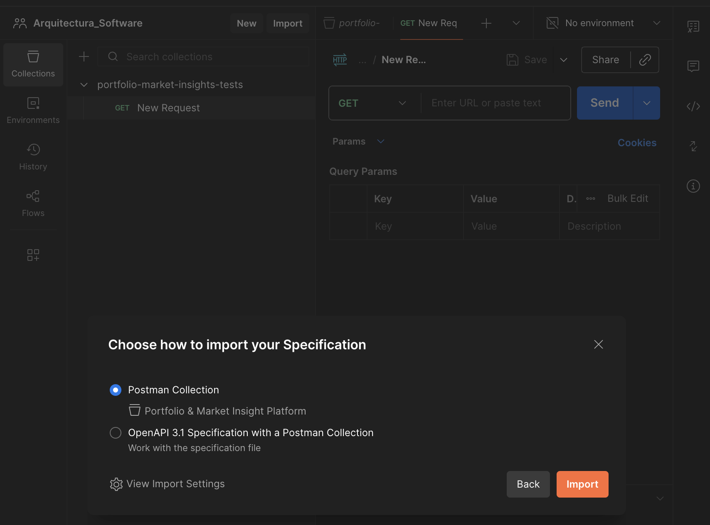
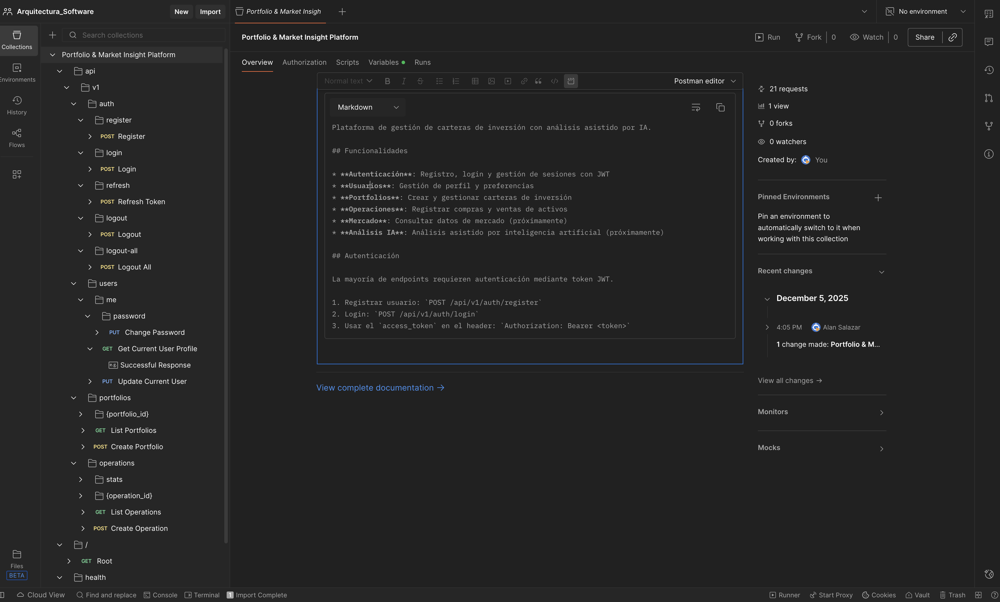
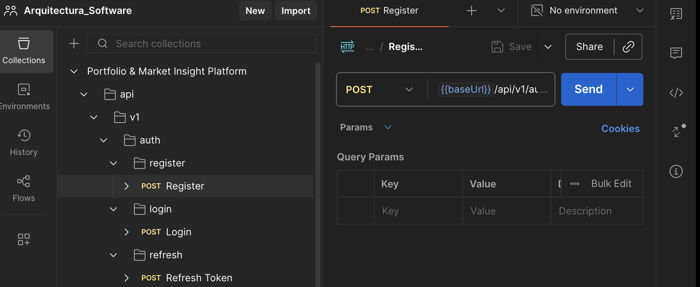

# Guía de Pruebas con Postman

Este documento describe cómo realizamos pruebas de todos los endpoints de la API utilizando Postman. La herramienta nos permite registrar y documentar el uso de cada endpoint creado.

## Prerrequisitos

Antes de comenzar, nos aseguramos de tener la API en ejecución.

## Paso 1: Iniciar la API

Ejecutamos el siguiente comando desde la raíz del proyecto:

```bash
cd backend
uvicorn main:app --reload --port 8000
```

Una vez que la API esté en ejecución, podremos acceder a ella desde Postman.

## Paso 2: Importar la Colección de Postman

Postman nos permite importar automáticamente todos los endpoints desde el archivo OpenAPI generado por FastAPI. Esto evita tener que crear cada endpoint manualmente.

### Instrucciones de Importación

1. Abrimos Postman
2. Hacemos clic en **Import** (botón ubicado en la esquina superior izquierda)
3. Seleccionamos la pestaña **Link**
4. Pegamos la siguiente URL:
   ```
   http://localhost:8000/openapi.json
   ```
5. Hacemos clic en **Continue** → **Import**



Postman creará automáticamente una colección con:
- Todos los endpoints disponibles (`/auth`, `/users`, `/portfolios`, `/operations`, `/health`, etc.)
- Métodos HTTP correctos (GET, POST, PUT, DELETE, etc.)
- Parámetros de ruta, query y cuerpos de ejemplo según los esquemas Pydantic definidos



Esta importación masiva nos permite no tener que escribir cada endpoint manualmente y facilita el testing de toda la aplicación.

## Paso 3: Configurar la Variable de Entorno Base URL

Como estamos trabajando en un entorno local, necesitamos configurar la variable `base_url` para que apunte a `localhost:8000`.

1. En Postman, vamos a la colección importada
2. Hacemos clic en la pestaña **Variables**
3. Actualizamos la variable `base_url` con el valor: `http://localhost:8000`



Ahora podemos usar `{{base_url}}` en todas nuestras solicitudes para facilitar el cambio de entorno más adelante.


Una vez completados estos pasos, podremos:
- Probar todos los endpoints de la API
- Ver la documentación generada automáticamente
- Guardar ejemplos de respuestas
- Reutilizar las configuraciones en diferentes entornos
